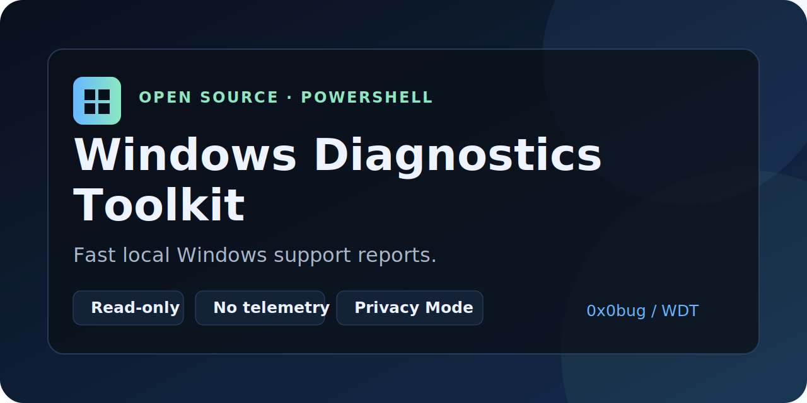

# Windows Diagnostics Toolkit



**Generate a local Windows support report with diagnostics that are read-only by design with automated safety checks.**

Windows Diagnostics Toolkit is an open-source PowerShell toolkit for Windows 10 and Windows 11. It collects security, performance, network, disk, crash, service, Event Log, time-sync, and Windows Update context into TXT and optional Markdown reports.

- Read-only by design with automated safety checks
- No installer or third-party PowerShell modules
- No telemetry, upload, remote collection, or automatic fixes
- Local reports with an aggregated `OK` / `WARN` / `ERROR` findings summary
- Optional `-PrivacyMode` for reports that will be shared
- Compatible with Windows PowerShell 5.1 and PowerShell 7

[Project website](https://0x0bug.github.io/windows-diagnostics-toolkit/) · [Usage guide](docs/usage.md) · [Anonymized report example](docs/report-example.md) · [Report a problem](https://github.com/0x0bug/windows-diagnostics-toolkit/issues/new/choose)

## Quick start

### Interactive mode

Clone the repository and start the toolkit without switches:

```powershell
git clone https://github.com/0x0bug/windows-diagnostics-toolkit.git
cd windows-diagnostics-toolkit
.\Invoke-WindowsDiagnostics.ps1
```

Running without switches opens the interactive TUI. Recommended diagnostics, Privacy Mode, and Markdown export are enabled by default; the menu lets you change the selected modules and output directory.
The TUI uses a normal layout from 60x25 and a compact layout from 40x18. It uses console colors when available and keeps the same text markers in monochrome terminals. Below 40x18 it asks you to resize the window before showing the menu.

If Windows PowerShell reports that script execution is disabled, use this process-only launch command:

```powershell
powershell.exe -NoProfile -ExecutionPolicy Bypass `
  -File .\Invoke-WindowsDiagnostics.ps1
```

This opens the same interactive TUI. The one-run execution-policy bypass applies only to the new PowerShell process; it does not change the machine-wide or current-user execution policy and does not require PowerShell 7.

If PowerShell reports that `pwsh` is not recognized, PowerShell 7 is not installed or is not available on `PATH`; installing PowerShell 7 is optional because the toolkit supports the built-in Windows PowerShell 5.1 command above.

### Command-line mode

Explicit module switches run diagnostics immediately without opening the TUI:

```powershell
.\Invoke-WindowsDiagnostics.ps1 -All -PrivacyMode -ExportMarkdown
.\Invoke-WindowsDiagnostics.ps1 -System -Security -Network
```

Windows PowerShell 5.1 non-interactive example:

```powershell
powershell.exe -NoProfile -ExecutionPolicy Bypass `
  -File .\Invoke-WindowsDiagnostics.ps1 -All -PrivacyMode -ExportMarkdown
```

Without module switches the Windows PowerShell command opens the TUI. With `-All` or one or more module switches it runs directly in command-line mode.

Reports are written to the current directory unless `-OutputDirectory` is provided:

```text
WindowsDiagnosticsReport-YYYYMMDD-HHMMSS.txt
WindowsDiagnosticsReport-YYYYMMDD-HHMMSS.md
```

## What it checks

| Area | Read-only context collected |
| --- | --- |
| System | Windows version, CPU, memory, GPU, uptime, system drive |
| Security | Defender, Firewall, Secure Boot, TPM, BitLocker status |
| Performance | Memory, CPU snapshot, pagefile, top processes by memory and cumulative CPU time |
| Network | Adapters, IP/DNS/DHCP, gateways, routes, WinINET/WinHTTP proxy, reachability |
| Time | W32Time service, timezone, clock, source, status, optional events |
| Disk | Physical disk health and volume free space |
| Crashes | Application crash/hang events, BugCheck events, dump-file metadata |
| Event Log | Recent Critical and Error events from System and Application logs |
| Services | Automatic services not running, optional startup and scheduled-task checks |
| Windows Update | Version, recent updates, reboot indicators, update-related services and optional events |

The report begins with a findings summary so the user does not need to inspect every section before seeing what needs attention.

## Share reports safely

Use `-PrivacyMode` when attaching a report to a GitHub issue, forum post, chat, or support request:

```powershell
.\Invoke-WindowsDiagnostics.ps1 -All -PrivacyMode -ExportMarkdown
```

Privacy Mode replaces identifying values with stable per-report tokens such as:

```text
<HOST-1>
<USER-1>
<IP-1>
<MAC-1>
<ID-1>
```

Process, application, and dump-file names remain visible because they are diagnostically useful. Proxy credentials and sensitive URL query values are removed from combined reports even when Privacy Mode is disabled.

Review every report before publishing it. Standalone module output is raw and local; `-PrivacyMode` applies to reports generated by `Invoke-WindowsDiagnostics.ps1`.

## Run selected checks

```powershell
.\Invoke-WindowsDiagnostics.ps1 -System
.\Invoke-WindowsDiagnostics.ps1 -Security
.\Invoke-WindowsDiagnostics.ps1 -Performance
.\Invoke-WindowsDiagnostics.ps1 -Network
.\Invoke-WindowsDiagnostics.ps1 -Time
.\Invoke-WindowsDiagnostics.ps1 -Disk
.\Invoke-WindowsDiagnostics.ps1 -Crashes
.\Invoke-WindowsDiagnostics.ps1 -Events
.\Invoke-WindowsDiagnostics.ps1 -Services
.\Invoke-WindowsDiagnostics.ps1 -Updates
```

Selectors can be combined:

```powershell
.\Invoke-WindowsDiagnostics.ps1 -System -Network -Disk -OutputDirectory .\reports
```

See the [usage guide](docs/usage.md) for standalone module parameters and detailed behavior.

## Safety model

The production scripts do not change network, disk, registry, services, scheduled tasks, Windows Update, firewall, DNS, routing, power, or system configuration.

Repository validation includes:

- PowerShell parser checks
- an AST-based guard against dangerous or mutating commands
- narrow allowlists for the diagnostic-only `w32tm.exe` and `netsh.exe` queries used by the toolkit
- detection of generated reports, logs, temporary files, and backup files left in the repository
- tests in both PowerShell 7 and Windows PowerShell 5.1

The safety guard reduces accidental scope expansion, but it is not a formal proof. Review the source before running any administrative tool on a sensitive machine.

## Requirements

- Windows 10 or Windows 11
- Windows PowerShell 5.1 or PowerShell 7+
- No third-party runtime dependencies
- Administrator rights are not required for normal use where Windows exposes the requested data to the current user

Some sources expose less detail without elevation. The toolkit reports unavailable data and continues where possible.

## Validation

PowerShell 7:

```powershell
pwsh -NoProfile -File .\scripts\validate.ps1
```

The `pwsh` command is available only when PowerShell 7 is installed. Windows PowerShell 5.1 users should use the command below.

Windows PowerShell 5.1:

```powershell
powershell.exe -NoProfile -ExecutionPolicy Bypass -File .\scripts\validate.ps1
```

The GitHub Actions workflow runs validation, dependency-free tests, and a report smoke test on pull requests and pushes to `main`.

## Documentation

- [Detailed usage](docs/usage.md)
- [Anonymized TXT and Markdown report](docs/report-example.md)
- [Project website and troubleshooting cases](site/index.html)
- [Contributing](CONTRIBUTING.md)
- [Security policy](SECURITY.md)

## License

MIT. See [LICENSE](LICENSE).
