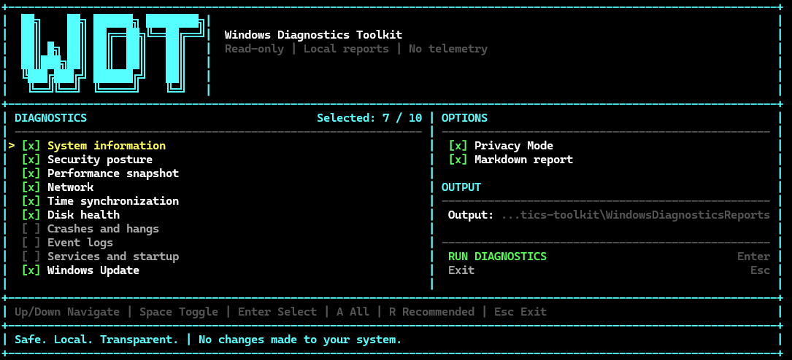
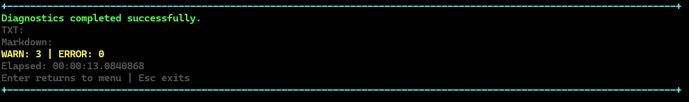

# Usage Guide

This guide covers the interactive TUI, command-line mode, standalone modules, report behavior, Privacy Mode, and common troubleshooting cases for Windows Diagnostics Toolkit.

All production diagnostics are read-only by design.

## Requirements

- Windows 10 or Windows 11
- Windows PowerShell 5.1 or PowerShell 7+
- No third-party PowerShell modules
- A terminal of at least `40x18` for the interactive interface

Administrator rights are optional. Some Windows data sources expose less detail without elevation; the toolkit reports unavailable data and continues where possible.

## Installation

Clone the repository:

```powershell
git clone https://github.com/0x0bug/windows-diagnostics-toolkit.git
cd windows-diagnostics-toolkit
```

No installation step is required.

## Interactive TUI

Run the entry point without module switches:

```powershell
.\Invoke-WindowsDiagnostics.ps1
```

<p align="center">
  
</p>

The initial state enables the recommended diagnostics, Privacy Mode, and Markdown export. The interface lets you:

- select or clear individual diagnostic modules;
- select all modules or restore the recommended set;
- toggle Privacy Mode;
- toggle Markdown report generation;
- change the output directory;
- run diagnostics;
- return to the menu after collection.

### Keyboard controls

| Key | Action |
| --- | --- |
| `Up` / `Down` | Move through menu items |
| `Space` | Toggle the highlighted module or option |
| `Enter` | Activate `RUN DIAGNOSTICS`, output directory, or exit |
| `A` | Select all diagnostic modules |
| `R` | Restore the recommended module selection |
| `Esc` | Exit the TUI |

The current selection and cursor position are preserved when the terminal is resized.

### Responsive layouts

| Layout | Minimum size | Description |
| --- | ---: | --- |
| Wide | `110x28` | Full two-column dashboard with the large logo |
| WideShort | `110x22` | Two-column dashboard with a compact header |
| Normal | `60x25` | Single-column layout capped for readability |
| Compact | `40x18` | Viewport showing the menu items that fit |
| TooSmall | below `40x18` | Resize instructions instead of a clipped menu |

A terminal around `120x30` or larger is recommended for the full dashboard.

### Unicode and ASCII logo selection

The logo mode is selected conservatively:

- interactive UTF-8 output can use the Unicode block logo;
- OEM encodings such as `cp866` use the ASCII fallback;
- redirected output always uses ASCII;
- an exception or unknown encoding falls back to ASCII.

Override the mode for the current process:

```powershell
$env:WDT_TUI_LOGO = 'auto'
$env:WDT_TUI_LOGO = 'unicode'
$env:WDT_TUI_LOGO = 'ascii'
```

`unicode` can be forced in an interactive host, but the host and font must support the glyphs. Redirected output remains ASCII even with the override.

Clear the override:

```powershell
Remove-Item Env:WDT_TUI_LOGO -ErrorAction SilentlyContinue
```

### Running and result screens

While diagnostics run, the TUI replaces the menu with a progress screen. Report-writing messages are suppressed so they do not corrupt the frame renderer.

After collection completes, the result screen displays:

- whether collection completed;
- TXT and optional Markdown report paths;
- `WARN` and `ERROR` finding counts;
- elapsed time;
- controls for returning to the menu or exiting.

<p align="center">
  
</p>

`WARN` represents diagnostic state that deserves review. It does not change the process exit code. A non-zero exit code means a module failed to execute.

## Command-line mode

Use `-All` or one or more module selectors to skip the TUI:

```powershell
.\Invoke-WindowsDiagnostics.ps1 -All
.\Invoke-WindowsDiagnostics.ps1 -All -PrivacyMode -ExportMarkdown
.\Invoke-WindowsDiagnostics.ps1 -Module System,Network
.\Invoke-WindowsDiagnostics.ps1 -Module Events,Updates
.\Invoke-WindowsDiagnostics.ps1 -System -Security -Network
```

`-Module` accepts built-in manifest IDs without regard to case. Duplicate IDs are removed and the final execution order comes from the registry, not from argument order. The general selector can be combined with the existing individual switches. `-All` selects every reviewed package discovered under `modules/`.

WDT does not load external plugin directories, current-directory scripts, user-profile modules, or remotely downloaded code. Built-in packages are part of the repository and must pass review, parser checks, and AST safety validation.

Module execution is bounded independently. The default is `-ModuleTimeoutSeconds 180`. After timeout WDT performs a bounded best-effort cleanup of the observed child tree and revalidates PID, ancestry, and creation time immediately before termination. Snapshot races and descendants created after the snapshot cannot be ruled out without stronger OS primitives, so cleanup failure is reported rather than hidden. Results from other modules are kept, and timeout is reported as `MODULE_EXECUTION_TIMEOUT` with duration and `Partial` completeness.

Windows PowerShell 5.1:

```powershell
powershell.exe -NoProfile -ExecutionPolicy Bypass `
  -File .\Invoke-WindowsDiagnostics.ps1 -All -PrivacyMode -ExportMarkdown
```

### Output directory

Reports are written to the current directory unless an explicit directory is provided:

```powershell
.\Invoke-WindowsDiagnostics.ps1 -System -Network `
  -OutputDirectory .\reports
```

Generated filenames:

```text
WindowsDiagnosticsReport-YYYYMMDD-HHMMSS.txt
WindowsDiagnosticsReport-YYYYMMDD-HHMMSS.md
```

See [Built-in Diagnostic Module Authoring](module-authoring.md) for the trusted package and manifest contract.

## Privacy Mode

Enable Privacy Mode when the combined report may be shared:

```powershell
.\Invoke-WindowsDiagnostics.ps1 -All -PrivacyMode -ExportMarkdown
```

Privacy Mode centrally redacts captured module output, findings, headers, and report paths before the wrapper writes TXT or Markdown. Identical values receive the same typed token within one report:

- `<HOST-1>` for a computer name
- `<USER-1>` for a user name
- `<IP-1>` for an IPv4 or IPv6 address
- `<MAC-1>` for a MAC address
- `<ID-1>` for a SID, GUID, or device identifier

The token map resets for each report. Process names, application names, and dump-file names remain visible for diagnostic context.

Combined reports always replace proxy URL credentials and sensitive query values with `<REDACTED>`, including when Privacy Mode is disabled.

Standalone scripts do not accept Privacy Mode. Their output remains raw and local.

## Findings and exit codes

Each combined report starts with `Findings Summary`.

Findings and collection metadata use these meanings:

- `OK`: module completed and emitted no warning or error findings;
- `WARN`: state should be reviewed, but collection completed;
- `ERROR`: diagnostic state is considered serious.
- `Partial`: the module started but timed out or returned a non-zero exit code;
- `Indeterminate`: available signals do not justify a positive or negative diagnosis.

Module completeness in this release is execution-only: `Success` maps to `Complete`; non-zero exit and timeout map to `Partial`; launch error and cancellation map to `Unavailable`. It does not infer source availability from finding-code names. Overall collection is `Unavailable` only when every module is unavailable, `Complete` only when every module succeeds, and `Partial` otherwise.

Overall severity follows `ERROR` > `WARN` > `OK`.

Finding severity does not determine the wrapper exit code. The wrapper returns a non-zero exit code when one or more diagnostic modules fail to execute.

Internal finding protocol markers are removed before TXT and Markdown reports are written.

## Module reference

### System Information

Collects operating system, CPU, memory, GPU, uptime, and system-drive information.

```powershell
.\Invoke-WindowsDiagnostics.ps1 -System
pwsh -NoProfile -File .\scripts\system-info.ps1
```

### Security Posture

Reads Defender, Windows Firewall, Secure Boot, TPM, and BitLocker status. Recovery keys, key protectors, and hardening changes are not requested.

```powershell
.\Invoke-WindowsDiagnostics.ps1 -Security
pwsh -NoProfile -File .\scripts\security-posture.ps1
```

### Performance Snapshot

Takes three short CPU load samples and two process samples. Current process activity is calculated from the `TotalProcessorTime` delta divided by elapsed time and logical processor count. A single high CPU sample is not a confirmed warning. Cumulative CPU time remains a separate metric. Process paths, owners, and command lines are not collected.

```powershell
.\Invoke-WindowsDiagnostics.ps1 -Performance
pwsh -NoProfile -File .\scripts\performance-snapshot.ps1
```

Standalone thresholds can be adjusted:

```powershell
pwsh -NoProfile -File .\scripts\performance-snapshot.ps1 `
  -TopProcessCount 20 -LowMemoryPercent 20 -HighCpuPercent 90
```

### Network Diagnostics

Collects adapters, addresses, DHCP, DNS, gateways, routes, WinINET/WinHTTP proxy context, and independent reachability signals.

```powershell
.\Invoke-WindowsDiagnostics.ps1 -Network
pwsh -NoProfile -File .\scripts\network-check.ps1
```

Optional standalone parameters:

```powershell
pwsh -NoProfile -File .\scripts\network-check.ps1 `
  -DnsTestName www.microsoft.com -HttpsEndpoint https://www.microsoft.com/ -IcmpTarget 1.1.1.1 -TimeoutSeconds 3
```

The wrapper exposes the same probes as `-NetworkDnsTestName`, `-NetworkHttpsEndpoint`, and `-NetworkIcmpTarget`. DNS uses the system resolver; TCP opens a connection to the HTTPS endpoint host/port without sending user data or an HTTP request; ICMP is optional evidence and cannot by itself prove internet failure. Results are `Reachable`, `Unreachable`, `BlockedOrFiltered`, `Indeterminate`, or `NotTested`. Use `-NoExternalNetworkTests` to skip DNS, external TCP, and external ICMP probes. Local adapter, route, gateway, and proxy collection still runs.

The module only uses the read-only `netsh.exe winhttp show proxy` form.

### Time Sync Diagnostics

Reads W32Time service state, domain membership, timezone, local and UTC time, configured source, verbose status, and optional Time-Service events.

```powershell
.\Invoke-WindowsDiagnostics.ps1 -Time
pwsh -NoProfile -File .\scripts\time-sync-diagnostics.ps1
```

Optional standalone events:

```powershell
pwsh -NoProfile -File .\scripts\time-sync-diagnostics.ps1 `
  -SinceDays 14 -MaxEvents 20 -IncludeTimeServiceEvents
```

The module only queries `w32tm.exe /query /source` and `w32tm.exe /query /status /verbose`. It does not configure or resynchronize time. Native output is decoded with the current Windows OEM code page.

### Storage Status

Reads Windows-reported physical disk state, volume free space, and reliability counters when `Get-StorageReliabilityCounter` supports the device. Missing counters are normal for some USB, RAID, virtual, and controller-backed disks and are not a warning. This is not a complete SMART or NVMe diagnostic. No new serial numbers or device identifiers are collected. The default low-space warning threshold is 15 percent.

```powershell
.\Invoke-WindowsDiagnostics.ps1 -Disk
pwsh -NoProfile -File .\scripts\disk-health.ps1
```

Custom threshold:

```powershell
pwsh -NoProfile -File .\scripts\disk-health.ps1 `
  -LowFreeSpacePercent 20
```

### Crash and Hang Diagnostics

Reads Application Error, Windows Error Reporting, Application Hang, BugCheck, available Reliability Monitor records, and dump-file metadata. Event and reliability evidence for the same application failure is deduplicated, then repeated failures are grouped by application, crash or hang type, and failure code when available. Dump contents are never read.

The default lookback is 7 days. A single application crash older than 24 hours remains context; recent or repeated failures can create `WARN`, while `ERROR` is reserved for repeated recent BugChecks. If Reliability Monitor is unavailable, Event Log remains the assessment fallback. Individual unavailable sources remain context; `CRASH_ASSESSMENT_UNAVAILABLE` appears only when all four crash Event Log sources and Reliability Monitor are unavailable. Dump metadata never substitutes for those assessment sources.

```powershell
.\Invoke-WindowsDiagnostics.ps1 -Crashes
pwsh -NoProfile -File .\scripts\crash-hang-diagnostics.ps1
```

Custom bounds:

```powershell
pwsh -NoProfile -File .\scripts\crash-hang-diagnostics.ps1 `
  -SinceDays 14 -MaxEvents 100 -MaxDumpFiles 10
```

### Event Log Check

Reads and groups recent Critical and Error events from the System and Application logs. Groups include provider, Event ID, level, count, first and last occurrence, and one representative message.

The default lookback is 24 hours. An event's Critical or Error level alone does not create a finding; most events remain context. Findings come only from a small documented high-signal subset. An individual unavailable query remains context; `EVENT_LOG_ASSESSMENT_UNAVAILABLE` appears only when the System log, Application log, and high-signal query are all unavailable.

```powershell
.\Invoke-WindowsDiagnostics.ps1 -Events
pwsh -NoProfile -File .\scripts\event-log-check.ps1
```

### Services and Startup

Checks service states, startup entries, and scheduled tasks. The main wrapper enables both optional inventories so the title matches the work performed. `Auto + Stopped` alone is displayed as `Indeterminate`, because trigger-start, delayed, conditional, and intentionally idle services can be stopped normally. Pending states are suspicious context; findings require a stronger signal such as an actionable service exit code or the explicitly documented critical RPC service being disabled. Exit code `1077` (not started since boot) remains context. An unavailable core `Win32_Service` inventory creates `SERVICE_INVENTORY_UNAVAILABLE`; unavailable startup entries and scheduled tasks remain context.

```powershell
.\Invoke-WindowsDiagnostics.ps1 -Services
pwsh -NoProfile -File .\scripts\services-check.ps1
```

Optional standalone checks:

```powershell
pwsh -NoProfile -File .\scripts\services-check.ps1 `
  -IncludeStartup -IncludeScheduledTasks
```

### Windows Update

Reads Windows version, recent installed updates, reboot indicators, update-related service context, and confirmed Windows Update installation or download failures. Matching failures are grouped with timestamp range, source, Event ID, update identifier or title, error code, and count.

The default failure lookback is 30 days. A stopped update-related service does not create a warning by itself because Windows can start manual and trigger-start services only when needed. A finding requires a confirmed recent failure, an update-specific pending reboot indicator, or an explicitly unavailable core update infrastructure state. Individual source failures remain context; `WINDOWS_UPDATE_ASSESSMENT_UNAVAILABLE` appears only when both failure logs, service inventory, and both update-specific reboot checks are unavailable.

```powershell
.\Invoke-WindowsDiagnostics.ps1 -Updates
pwsh -NoProfile -File .\scripts\windows-update-check.ps1
```

Use `-IncludeEventLog` with the standalone script to include representative event messages in addition to the grouped failure fields.

### Finding code migration

This signal-quality update removes generic-severity findings and consolidates source availability at assessment level. Consumers of finding codes should use the following migration:

| Previous code | Current behavior or code |
|---|---|
| `RECENT_CRITICAL_EVENTS`, `RECENT_ERROR_EVENTS` | Generic events are context; documented matches use `EVENT_UNEXPECTED_SHUTDOWN` or `EVENT_FILE_SYSTEM_CORRUPTION` |
| `EVENT_LOG_SOURCE_UNAVAILABLE` | `EVENT_LOG_ASSESSMENT_UNAVAILABLE` only when System, Application, and the high-signal query are all unavailable; individual failures are context |
| `WINDOWS_UPDATE_EVENT_ISSUES` | `WINDOWS_UPDATE_INSTALL_FAILURE` or `WINDOWS_UPDATE_DOWNLOAD_FAILURE` |
| `WINDOWS_UPDATE_SERVICE_ISSUES` | `WINDOWS_UPDATE_INFRASTRUCTURE_UNAVAILABLE` only for the core-service rule |
| `WINDOWS_UPDATE_SOURCE_UNAVAILABLE` | `WINDOWS_UPDATE_ASSESSMENT_UNAVAILABLE` only when both failure logs, service inventory, and update-specific reboot checks are all unavailable; individual failures are context |
| `SERVICE_STATE_CONFIRMED` | `SERVICE_EXIT_CODE_NONZERO` or `CRITICAL_SERVICE_DISABLED`; pending state is context |
| `SERVICE_INVENTORY_UNAVAILABLE` | Retained for unavailable core `Win32_Service` inventory |
| `STARTUP_SOURCE_UNAVAILABLE`, `SCHEDULED_TASK_SOURCE_UNAVAILABLE` | Unavailable optional inventory is context only |
| `CRASH_APPLICATION_EVENTS_UNAVAILABLE`, `CRASH_BUGCHECK_EVENTS_UNAVAILABLE` | `CRASH_ASSESSMENT_UNAVAILABLE` only when all crash Event Log sources and Reliability Monitor are unavailable; individual failures are context |
| `CRASH_DUMP_METADATA_UNAVAILABLE`, `CRASH_RECENT_DUMPS_FOUND` | Dump availability and presence are context only |

`PENDING_REBOOT`, `CRASH_APPLICATION_FAILURES_DETECTED`, and `CRASH_BUGCHECK_DETECTED` are retained. Their evidence now includes grouped counts and timestamps; crash severity also accounts for recency and repetition.

## Troubleshooting

### Script execution is disabled

Use a process-only bypass:

```powershell
powershell.exe -NoProfile -ExecutionPolicy Bypass `
  -File .\Invoke-WindowsDiagnostics.ps1
```

This does not modify persistent execution-policy settings.

### `pwsh` is not recognized

PowerShell 7 is optional. Use the built-in Windows PowerShell command:

```powershell
powershell.exe -NoProfile -ExecutionPolicy Bypass `
  -File .\Invoke-WindowsDiagnostics.ps1
```

### ASCII appears instead of the Unicode logo

Check the active output encoding:

```powershell
[Console]::OutputEncoding.WebName
```

An OEM value such as `cp866` intentionally selects the ASCII fallback. A compatible interactive host can be tested with:

```powershell
$env:WDT_TUI_LOGO = 'unicode'
.\Invoke-WindowsDiagnostics.ps1
Remove-Item Env:WDT_TUI_LOGO -ErrorAction SilentlyContinue
```

### The interface asks for a larger terminal

Resize the terminal to at least `40x18`. Use `110x28` or larger for the full Wide dashboard.

### Some values are unavailable

Run from an elevated terminal only when the missing source is important and you understand the additional access. The toolkit continues when individual read-only sources are unavailable.

### The report contains warnings

A warning describes observed state. Read the evidence in `Findings Summary` and the corresponding module section. The toolkit does not apply a fix automatically.

### Russian `w32tm` text is unreadable

Use the current version of the toolkit. It launches `w32tm.exe` with redirected streams and decodes output using the Windows OEM code page instead of PowerShell's native pipeline.

## Validate the repository

PowerShell 7:

```powershell
pwsh -NoProfile -File .\scripts\validate.ps1
```

Windows PowerShell 5.1:

```powershell
powershell.exe -NoProfile -ExecutionPolicy Bypass `
  -File .\scripts\validate.ps1
```
